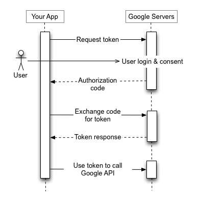
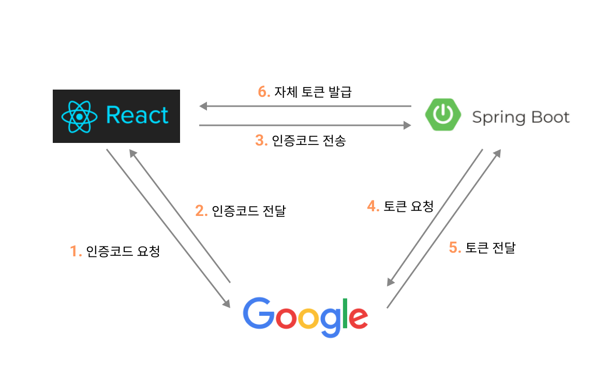
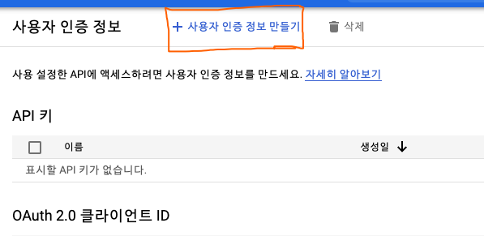
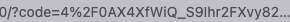

# OAuth 2.0

OAuth를 쓰는 이유에 대해 프론트엔드 개발자 그리고 기획자의 입장에서 생각해보면 OAuth는 쉽고 빠른 회원가입과 로그인을 유저에게 제공할 수 있다는 점입니다.

또한 로그인, 개인정보 등에 관한 관리 책임을 서드 파티 애플리케이션(구글, 카카오, 네이버 등)에게 위임 할 수 있다는 점도 장점입니다. 

특히 신규 서비스의 경우, 유저의 진입장벽을 낮추고 또한 보안에 대한 리스크도 줄일 수 있다는 점에 Oauth가 합리적인 방식이라는 생각도 했습니다.

Oauth란 인터넷 사용자들이 비밀번호를 제공하지 않고 다른 웹사이트 상의 자신들의 정보에 대해 웹사이트나 애플리케이션의 접근 권한을 부여할 수 있는 공통적인 수단으로서 사용되는, 접근 위임을 위한 개방형 표준이라고 합니다. 
<br/>

# 1. Oauth 작동 방식

### Oauth 참여자

Oauth 동작에는 크게 세 가지의 참여자로 분류할 수 있습니다.
- Client: OAuth 2.0을 사용하여 로그인 기능을 구현할 웹 어플리케이션 입니다.
- Resource Server: Client가 제어하고자 하는 자원을 보유하고 있는 서드파티 애플리케이션입니다.
- Authorization Server:  권환을 부여하는 서버입니다. 구글의 경우 Access Token을 부여합니다.
- Resource Owner: Client가 제공하는 서비스 사용자이자, 서드파티 애플리케이션에 정보를 저장하고 있는 유저입니다. 
<br/>

### 시나리오
<br/>

<br/>

### 동작 방식

아래의 동작 방식은 이번 프로젝트에서 제가 구현한 로직입니다. 이는 OAuth 구현 방식의 한가지 방식에 불과하며, 절대적인 방식은 아닙니다.



# 2. Oauth 구현

### 0. 구글 콘솔 등록

하단의 이미지와 같이 해당 링크 [구글 API 및 서비스](https://console.cloud.google.com/apis/)를 통해 OAuth 2.0 클라이언트 ID를 발급 받으실 수 있습니다.


사용자 인증 정보 만들기 > OAuth 클라이언트 ID 만들기 > 동의 화면 만들기 > 승인된 리디렉션 URI 설정
위의 순서대로 진행하면 클라이언트 ID를 발급받으실 수 있습니다. 

- REDIRECT URI는 리다이렉트 되는 주소로 프론트엔드와 백엔드가 합의해서 동일한 주소를 가져야 합니다.
- CLIENT ID : 클라이언트를 구별할 수 있는 식별자입니다.
- CLIENT SECRET : CLIENT ID에 대한 노출하면 안되는 비밀키 입니다.
<br/>

### 1. 인증 코드(Access Token) 요청

[클라이언트 측 웹 애플리케이션용 OAuth 2.0](https://developers.google.com/identity/protocols/oauth2/javascript-implicit-flow#oauth-2.0-endpoints)에 따르면, `GET`으로 아래의 url을 통해 인증코드를 받아올 수 있습니다.

```
https://accounts.google.com/o/oauth2/v2/auth?scope={SCOPE}&client_id=${CLIENT_ID}&response_type=code&redirect_uri=${REDIRECT_URI}&access_type=offline
```

- 이때, CLIENT_ID는 구글 OAuth 2.0의 클라이언트 ID를 넣어주면 됩니다. SCOPE은 받아올 데이터의 범위를 의미합니다.
<br/>

### 2. 인증 코드를 받아서 백엔드로 전달
이후 인증코드는 리다이렉트 URI를 통해 아래의 이미지와 같이 파라미터로 전달됩니다.


리엑트의 경우 query-string 라이브러리를 통해 쉽게 code를 받아올 수 있습니다. 전달받은 `code`값은 백엔드로 전달합니다.

```javascript
const parsed = queryString.parse(location.search);
const code = parsed.code
const getToken = async () => {
	try {
		const res = await axios.get({로컬호스트_API})
	} catch (err) {
		// 에러핸들링
	}
}
``` 
<br/>

### 3. 백엔드에서 서비스 자체의 토큰을 클라이언트로 전달
백엔드는 클라이언트로 부터 받은 인증 코드를 통해, 구글로 부터 토큰을 받아오고 자체 토큰으로 재발행하여 클라이언트로 넘겨주면 됩니다.
<br/>

# 4. 끝맺음
팀 프로젝트를 진행하면서 Oauth를 적용해볼 기회가 생겼으나 동작방식에 대해 이해하는 것이 쉽지는 않았습니다. 그리고 제가 구현한 방식 또한 하나의 예시일 뿐이며 OAuth 구현방식은 다양하다고 볼 수 있습니다. 이번 백엔드와 프론트엔드가 다른 리다이렉트 URI를 사용하고 있어, 고생하기도 했습니다. 이번 프로젝트에서 리다이렉트 URI의 역할이 무엇인지 확고하게 알 수 있게 되었습니다. 

<br/>

#### 참고자료
> [클라이언트 측 웹 애플리케이션용 OAuth 2.0](https://developers.google.com/identity/protocols/oauth2/javascript-implicit-flow#oauth-2.0-endpoints)

> [REACT로 카카오, 네이버 소셜 로그인 구현하기](https://2dowon.netlify.app/react/social_login/)